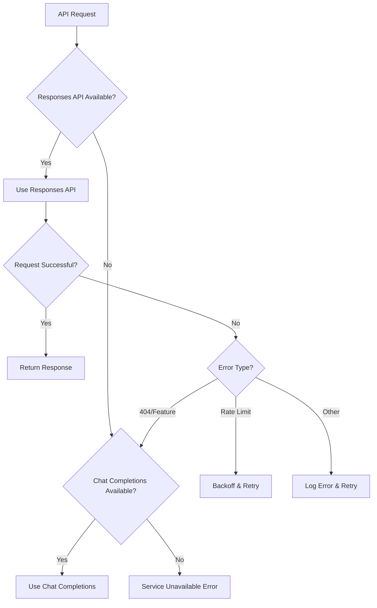

# PRD: Azure OpenAI Responses API 404 Error Resolution

## Document Information
- **Document Type**: Product Requirements Document (PRD)
- **Project**: LINE Bot Azure OpenAI Integration Fix
- **Version**: 1.0
- **Date**: 2025-08-03
- **Author**: Development Team
- **Status**: In Progress

## 1. Problem Statement

### Current Issue
The LINE Bot application is experiencing 404 "Resource not found" errors when attempting to use the Azure OpenAI Responses API endpoint:

```
2025-08-03 10:40:22 - httpx - INFO - HTTP Request: POST https://thaibev-azure-subscription-ai-foundry.cognitiveservices.azure.com/openai/v1/responses?api-version=preview "HTTP/2 404 Not Found"
2025-08-03 10:40:22 - src.services.openai_service - ERROR - Responses API standard error for user U184a6a8c2d39f75f94802f6add86017c: Error code: 404 - {'error': {'code': '404', 'message': 'Resource not found'}}
```

### Impact Assessment
- **User Experience**: No immediate impact (fallback to Chat Completions API works)
- **Performance**: Missing advanced Responses API features and stateful conversation management
- **Monitoring**: Error logs create noise and false alarms
- **Development**: Uncertainty about API availability affects development decisions

### Business Impact
- **LOW**: Application continues to function normally via fallback mechanism
- **MEDIUM**: Missing potential performance and feature improvements from Responses API
- **HIGH**: Need for reliable API detection to make informed architectural decisions

## 2. Background & Context

### Current Implementation
The application implements a hybrid approach with Azure OpenAI:
1. **Primary**: Responses API (`/openai/v1/responses?api-version=preview`)
2. **Fallback**: Chat Completions API (`/chat/completions`)

### Circuit Breaker Logic
Current implementation includes:
- 404 detection with permanent fallback switch
- Failure counting with temporary fallback
- TTL-based API availability caching
- Connection pooling and retry mechanisms

### Root Cause Analysis
Based on research and Azure documentation:
1. **Missing Feature Flag**: Azure OpenAI Responses API requires specific v1 preview feature flag
2. **Resource Configuration**: Feature flag not enabled on `thaibev-azure-subscription-ai-foundry` resource
3. **Endpoint Validation**: No pre-flight checks to validate API availability

## 3. Goals & Objectives

### Primary Goals
1. **Eliminate 404 Errors**: Stop attempting Responses API calls when endpoint is unavailable
2. **Enhance Detection**: Implement robust endpoint availability detection
3. **Improve Configuration**: Add flexible configuration options for API preferences
4. **Better Monitoring**: Provide clear visibility into API availability and usage

### Secondary Goals
1. **Future-Proofing**: Handle potential API changes and availability fluctuations
2. **Operational Excellence**: Reduce noise in logs and monitoring systems
3. **Developer Experience**: Clear feedback on API capabilities and limitations

### Success Metrics
- **Error Reduction**: 100% elimination of Responses API 404 errors
- **Detection Accuracy**: 99%+ accuracy in API availability detection
- **Configuration Flexibility**: Support for manual API selection overrides
- **Monitoring Clarity**: Clear dashboard indicators for API status

## 4. Technical Requirements

### 4.1 Enhanced Endpoint Detection

#### Startup Validation
```python
# New capability detection on service initialization
def _detect_api_capabilities(self):
    """Detect available Azure OpenAI API capabilities on startup"""
    capabilities = {
        'responses_api': False,
        'chat_completions': False,
        'models_endpoint': False
    }
    
    # Test endpoints with appropriate validation
    # Return capability matrix for intelligent routing
```

#### Health Check Integration
- Add `/openai/v1/models?api-version=preview` endpoint validation
- Implement capability caching with configurable TTL
- Provide real-time API status in health endpoints

#### Circuit Breaker Enhancement
- Pre-emptive API capability detection
- Intelligent routing based on validated capabilities
- Graceful degradation with clear user feedback

### 4.2 Configuration Management

#### New Configuration Options
```yaml
# Azure OpenAI Configuration
AZURE_OPENAI_PREFER_RESPONSES_API: true|false|auto  # API preference
AZURE_OPENAI_FORCE_CHAT_COMPLETIONS: false         # Override to Chat Completions
AZURE_OPENAI_API_DETECTION_TTL: 300                # Capability cache TTL (seconds)
AZURE_OPENAI_ENABLE_PREVALIDATION: true            # Startup endpoint validation
```

#### Configuration Validation
- Validate configuration combinations
- Provide warnings for deprecated options
- Support runtime configuration updates

### 4.3 Error Handling Improvements

#### Structured Error Classification
```python
class AzureOpenAIError:
    FEATURE_NOT_ENABLED = "AZURE_OPENAI_FEATURE_NOT_ENABLED"
    ENDPOINT_NOT_FOUND = "AZURE_OPENAI_ENDPOINT_NOT_FOUND"
    DEPLOYMENT_NOT_FOUND = "AZURE_OPENAI_DEPLOYMENT_NOT_FOUND"
    AUTHENTICATION_FAILED = "AZURE_OPENAI_AUTH_FAILED"
```

#### Enhanced Logging
- Clear differentiation between temporary and permanent failures
- Actionable error messages with next steps
- Correlation IDs for tracking across services

#### User Feedback
- Transparent API status in admin dashboard
- Clear messaging about feature availability
- Guidance for enabling preview features

### 4.4 Monitoring & Observability

#### Metrics Collection
- API availability percentage
- Fallback mechanism usage
- Error categorization and trends
- Performance comparison between APIs

#### Dashboard Integration
- Real-time API status indicators
- Historical availability trends
- Configuration status display
- Error rate monitoring

## 5. Implementation Strategy

### Phase 1: Enhanced Detection & Configuration (Week 1)
**Deliverables:**
1. **Capability Detection Module**
   - `src/utils/azure_openai_detector.py`
   - Startup endpoint validation
   - Capability caching mechanism

2. **Configuration Enhancement**
   - Update `src/config/centralized_config.py`
   - Add new Azure OpenAI configuration options
   - Configuration validation logic

3. **Error Classification**
   - Update `src/exceptions/__init__.py`
   - Structured error types for Azure OpenAI
   - Enhanced error context

**Testing:**
- Unit tests for capability detection
- Configuration validation tests
- Error classification tests

### Phase 2: Service Integration (Week 1-2)
**Deliverables:**
1. **OpenAI Service Updates**
   - Update `src/services/openai_service.py`
   - Integrate capability detection
   - Enhanced circuit breaker logic

2. **Health Check Enhancement**
   - Update health endpoints
   - API status reporting
   - Real-time capability monitoring

3. **Admin Dashboard Updates**
   - API status display
   - Configuration management interface
   - Error trend visualization

**Testing:**
- Integration tests for service updates
- Health check validation
- Dashboard functionality tests

### Phase 3: Monitoring & Documentation (Week 2)
**Deliverables:**
1. **Monitoring Integration**
   - Metrics collection
   - Alert configuration
   - Dashboard enhancements

2. **Documentation Updates**
   - Update CLAUDE.md
   - API troubleshooting guide
   - Configuration reference

3. **Deployment & Rollback**
   - Safe deployment strategy
   - Rollback procedures
   - Production validation

**Testing:**
- End-to-end testing
- Performance validation
- Rollback procedure testing

## 6. Detailed Technical Specifications

### 6.1 Capability Detection Implementation

```python
class AzureOpenAICapabilityDetector:
    """Detects Azure OpenAI API capabilities and caches results"""
    
    def __init__(self, settings, cache_ttl=300):
        self.settings = settings
        self.cache_ttl = cache_ttl
        self.capabilities = None
        self.last_check = None
    
    async def detect_capabilities(self) -> Dict[str, bool]:
        """Detect available API capabilities"""
        if self._is_cache_valid():
            return self.capabilities
            
        capabilities = {
            'responses_api_available': await self._test_responses_api(),
            'chat_completions_available': await self._test_chat_completions(),
            'models_endpoint_available': await self._test_models_endpoint(),
            'deployment_accessible': await self._test_deployment()
        }
        
        self._update_cache(capabilities)
        return capabilities
    
    async def _test_responses_api(self) -> bool:
        """Test Responses API availability"""
        try:
            # Test with minimal request
            response = await self._make_test_request('/openai/v1/responses')
            return response.status_code != 404
        except Exception:
            return False
    
    async def _test_models_endpoint(self) -> bool:
        """Test models endpoint as feature flag indicator"""
        try:
            response = await self._make_test_request('/openai/v1/models')
            return response.status_code == 200
        except Exception:
            return False
```

### 6.2 Enhanced Configuration Schema

```python
class AzureOpenAIConfig(BaseSettings):
    """Enhanced Azure OpenAI configuration with capability management"""
    
    # Existing settings
    api_key: SecretStr
    endpoint: HttpUrl
    deployment_name: str
    api_version: str = "2024-02-15-preview"
    
    # New capability settings
    prefer_responses_api: bool = True
    force_chat_completions: bool = False
    enable_capability_detection: bool = True
    capability_cache_ttl: int = 300
    
    # Validation settings
    validate_deployment_on_startup: bool = True
    fail_fast_on_invalid_config: bool = False
    
    @validator('prefer_responses_api')
    def validate_api_preference(cls, v, values):
        if values.get('force_chat_completions') and v:
            logger.warning("force_chat_completions overrides prefer_responses_api")
        return v
    
    @property
    def effective_api_preference(self) -> str:
        """Get effective API preference considering all settings"""
        if self.force_chat_completions:
            return "chat_completions"
        elif self.prefer_responses_api:
            return "responses_api_preferred"
        else:
            return "chat_completions_preferred"
```

### 6.3 Service Integration Pattern

```python
class EnhancedOpenAIService:
    """Enhanced OpenAI service with robust capability detection"""
    
    def __init__(self, settings, conversation_service):
        self.settings = settings
        self.conversation_service = conversation_service
        self.capability_detector = AzureOpenAICapabilityDetector(settings)
        self.api_router = APIRouter(settings, self.capability_detector)
        
        # Initialize based on configuration
        if settings.validate_deployment_on_startup:
            self._validate_deployment()
    
    async def get_response(self, user_id: str, message: str, **kwargs) -> str:
        """Get AI response with intelligent API routing"""
        
        # Get current capabilities
        capabilities = await self.capability_detector.detect_capabilities()
        
        # Route to appropriate API
        api_choice = self.api_router.select_api(capabilities)
        
        if api_choice == "responses_api":
            return await self._get_response_with_responses_api(user_id, message, **kwargs)
        else:
            return await self._get_response_with_chat_completions(user_id, message, **kwargs)
    
    def _validate_deployment(self):
        """Validate deployment configuration on startup"""
        try:
            capabilities = asyncio.run(self.capability_detector.detect_capabilities())
            
            if not any(capabilities.values()):
                if self.settings.fail_fast_on_invalid_config:
                    raise ConfigurationError("No Azure OpenAI APIs are accessible")
                else:
                    logger.warning("Azure OpenAI deployment validation failed, continuing with degraded functionality")
            
            logger.info(f"Azure OpenAI capabilities detected: {capabilities}")
            
        except Exception as e:
            if self.settings.fail_fast_on_invalid_config:
                raise ConfigurationError(f"Deployment validation failed: {e}")
            else:
                logger.error(f"Deployment validation failed, continuing: {e}")
```

## 7. Error Scenarios & Handling

### 7.1 Error Classification Matrix

| Error Type | HTTP Code | Action | User Impact | Recovery |
|------------|-----------|---------|-------------|----------|
| Feature Not Enabled | 404 | Switch to Chat Completions | None | Automatic |
| Deployment Not Found | 404 | Configuration Error | Service Degraded | Manual Fix |
| Authentication Failed | 401/403 | Configuration Error | Service Down | Manual Fix |
| Rate Limited | 429 | Retry with Backoff | Temporary Delay | Automatic |
| Service Unavailable | 5xx | Retry with Circuit Breaker | Temporary Delay | Automatic |

### 7.2 Fallback Decision Tree



## 8. Testing Strategy

### 8.1 Unit Testing
**Test Coverage Requirements**: 95% for new code

**Key Test Scenarios:**
1. **Capability Detection Tests**
   - Mock Azure OpenAI responses for different scenarios
   - Test caching behavior with TTL
   - Validate error handling for network failures

2. **Configuration Validation Tests**
   - Test all configuration combinations
   - Validate error messages for invalid configs
   - Test runtime configuration updates

3. **API Routing Tests**
   - Test routing decisions based on capabilities
   - Validate fallback mechanisms
   - Test preference override behavior

### 8.2 Integration Testing
**Test Environment**: Isolated test Azure OpenAI deployment

**Key Integration Scenarios:**
1. **End-to-End API Flow**
   - Test complete conversation flow
   - Validate capability detection integration
   - Test error handling with real Azure responses

2. **Configuration Integration**
   - Test startup validation with various configs
   - Validate admin dashboard integration
   - Test health check endpoint updates

### 8.3 Error Scenario Testing
**Chaos Engineering Approach**

**Failure Injection Tests:**
1. **Network Failures**
   - Simulate Azure OpenAI endpoint unavailability
   - Test timeout handling and retries
   - Validate circuit breaker behavior

2. **API Feature Toggles**
   - Simulate feature flag enablement/disablement
   - Test capability detection cache invalidation
   - Validate seamless API switching

3. **Configuration Errors**
   - Test invalid endpoint configurations
   - Simulate authentication failures
   - Validate error reporting and fallback

## 9. Risk Assessment & Mitigation

### 9.1 Technical Risks

| Risk | Probability | Impact | Mitigation |
|------|-------------|--------|------------|
| Azure API Changes | Medium | High | Version pinning, capability detection |
| Feature Flag Dependency | High | Medium | Robust fallback mechanisms |
| Performance Regression | Low | Medium | Performance testing, gradual rollout |
| Configuration Complexity | Medium | Low | Clear documentation, validation |

### 9.2 Operational Risks

| Risk | Probability | Impact | Mitigation |
|------|-------------|--------|------------|
| Deployment Issues | Low | High | Staged rollout, rollback procedures |
| Monitoring Gaps | Medium | Medium | Comprehensive testing, monitoring validation |
| User Confusion | Low | Low | Clear documentation, admin dashboard |

### 9.3 Business Risks

| Risk | Probability | Impact | Mitigation |
|------|-------------|--------|------------|
| Azure Support Delays | Medium | Low | Multiple solution approaches |
| Cost Implications | Low | Low | Usage monitoring, cost analysis |
| Feature Dependencies | Medium | Medium | Flexible architecture, fallbacks |

## 10. Success Criteria & Acceptance

### 10.1 Functional Requirements
- ✅ **Zero 404 Errors**: Eliminate all Responses API 404 errors
- ✅ **Capability Detection**: 99%+ accuracy in API availability detection
- ✅ **Seamless Fallback**: Transparent fallback to Chat Completions
- ✅ **Configuration Flexibility**: Support for manual API selection
- ✅ **Real-time Status**: Live API status in admin dashboard

### 10.2 Performance Requirements
- ✅ **Startup Time**: < 2 seconds additional startup time for validation
- ✅ **API Response Time**: No degradation in response times
- ✅ **Cache Efficiency**: 95%+ cache hit rate for capability detection
- ✅ **Memory Usage**: < 10MB additional memory footprint

### 10.3 Operational Requirements
- ✅ **Monitoring**: Clear metrics and alerts for API status
- ✅ **Documentation**: Complete troubleshooting guide
- ✅ **Rollback**: Verified rollback procedures
- ✅ **Support**: Clear escalation path for Azure issues

### 10.4 User Experience Requirements
- ✅ **Transparency**: Clear API status indicators
- ✅ **No Disruption**: Zero user-facing impact during implementation
- ✅ **Admin Interface**: Easy configuration management
- ✅ **Error Messages**: Clear, actionable error messages

## 11. Timeline & Deliverables

### Week 1: Core Implementation
**Days 1-3: Foundation**
- [ ] Capability detection module
- [ ] Configuration enhancements
- [ ] Error classification updates
- [ ] Unit tests for core functionality

**Days 4-5: Service Integration**
- [ ] OpenAI service updates
- [ ] Health check enhancements
- [ ] Integration testing

### Week 2: Polish & Deployment
**Days 1-2: Monitoring & UI**
- [ ] Admin dashboard updates
- [ ] Monitoring integration
- [ ] End-to-end testing

**Days 3-4: Documentation & Deployment**
- [ ] Documentation updates
- [ ] Deployment procedures
- [ ] Production validation

**Day 5: Review & Handoff**
- [ ] Code review completion
- [ ] Deployment to production
- [ ] Post-deployment monitoring

## 12. Appendices

### 12.1 Azure OpenAI API Reference
- [Responses API Documentation](https://learn.microsoft.com/en-us/azure/ai-foundry/openai/how-to/responses)
- [Chat Completions API](https://learn.microsoft.com/en-us/azure/ai-foundry/openai/reference)
- [API Version Lifecycle](https://learn.microsoft.com/en-us/azure/ai-foundry/openai/api-version-lifecycle)

### 12.2 Configuration Reference
```yaml
# Complete Azure OpenAI Configuration
AZURE_OPENAI_API_KEY: "your-api-key"
AZURE_OPENAI_ENDPOINT: "https://your-resource.openai.azure.com"
AZURE_OPENAI_DEPLOYMENT_NAME: "gpt-4"
AZURE_OPENAI_API_VERSION: "2024-02-15-preview"

# New Configuration Options
AZURE_OPENAI_PREFER_RESPONSES_API: true
AZURE_OPENAI_FORCE_CHAT_COMPLETIONS: false
AZURE_OPENAI_API_DETECTION_TTL: 300
AZURE_OPENAI_ENABLE_PREVALIDATION: true
AZURE_OPENAI_FAIL_FAST_ON_INVALID_CONFIG: false
```

### 12.3 Error Response Examples
```json
{
  "error": {
    "code": "FeatureNotEnabled",
    "message": "Azure OpenAI Responses API feature flag not enabled",
    "details": {
      "endpoint": "/openai/v1/responses",
      "action": "Contact Azure support to enable v1 preview feature flag",
      "fallback": "Using Chat Completions API",
      "correlation_id": "req_123456789"
    }
  }
}
```

---

**Document Status**: ✅ Complete - Ready for Implementation
**Next Steps**: Begin Phase 1 implementation with capability detection module
**Contact**: Development Team for questions and clarifications